## Sort
### 插入排序

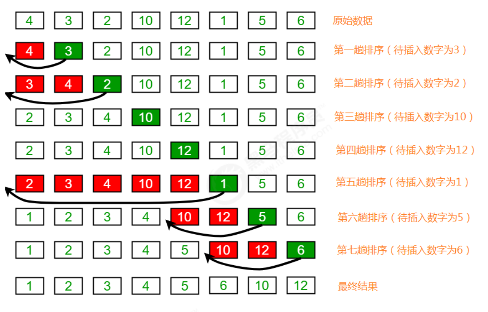

### 希尔排序
简单插入排序不管数组分布是怎么样的，依然一步一步的对元素进行比较，移动，插入，
比如[5,4,3,2,1,0]这种倒序序列，数组末端的0要回到首位置很费劲，比较和移动元素均需n-1次。
而希尔排序在数组中采用跳跃式分组的策略，通过某个增量将数组元素划分为若干组，然后分组进行插入排序，
随后逐步缩小增量，继续按组进行插入排序操作，直至增量为1。希尔排序通过这种策略使得整个数组在初始阶段
达到从宏观上看基本有序，小的基本在前，大的基本在后。然后缩小增量，到增量为1时，其实多数情况下只需微调即可，
不会涉及过多的数据移动。
##### 排序原理：
1. 选定一个增长量gap，按照增长量gap作为数据分组的依据，对数据进行分组；
2. 对分好组的每一组数据完成插入排序；
3. 减小增长量 gap/2，最小减为1，重复第二步操作。
4. 增长量的选取决定了希尔排序快不快，以下示例为了方便增长量选取length/2。具体标准如下

```
  //先设为1，再逐步修正
  int h = 1;
  while(h<a.length/2){
    h=2*h+1;
  }
```
##### 示例

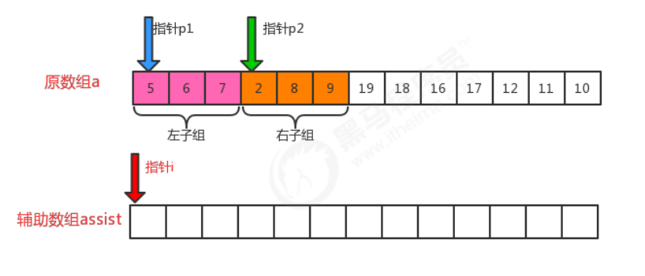

##### 代码实现移步到 Shell.java
##### 希尔排序时间复杂度与增长量的选取有关。

### 归并排序
归并排序是建立在归并操作上的一种有效的排序算法，该算法是采用分治法的一个非常典型的应用。将已有序的子
序列合并，得到完全有序的序列；即先使每个子序列有序，再使子序列段间有序。若将两个有序表合并成一个有序
表，称为二路归并。
#### 排序原理
1. 尽可能的一组数据拆分成两个元素相等的子组，并对每一个子组继续拆分，直到拆分后的每个子组的元素个数是1为止。这样每个组就有序了
2. 将相邻的两个子组进行合并成一个有序的大组；
3. 不断地重复步骤2，直到最终只有一个组为止。

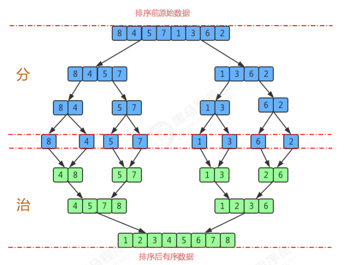

#### 归并的思路
先需要把有序的左子组和右子组归并为一个有序的大组
- 给左子组和右子组的第一个元素所在位置定义一个指针
- 构造一个辅助数组存放有序的大组，也定义一个指针指向首位置
- 把左子组和右子组的元素比较放入辅助数组


###### 第一次填充
比较p1和p2指针所在元素大小，p2<p1,将2放入辅助数组，p2指针向后移动,i指针向后移动，

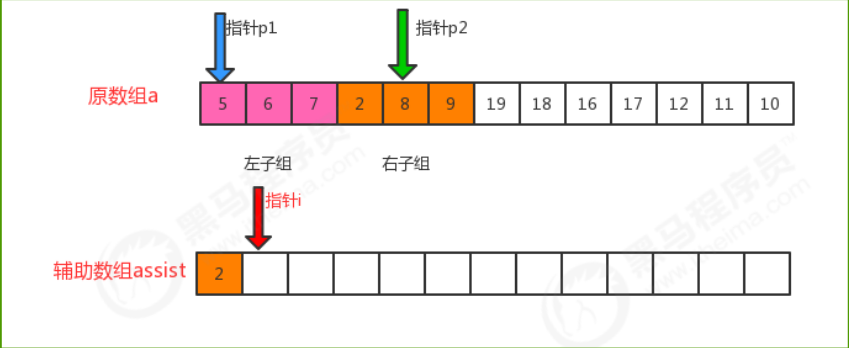

###### 第二次填充
比较p1和p2指针所在元素大小，p1<p2,将5放入辅助数组，p1指针向后移动,i指针向后移动，

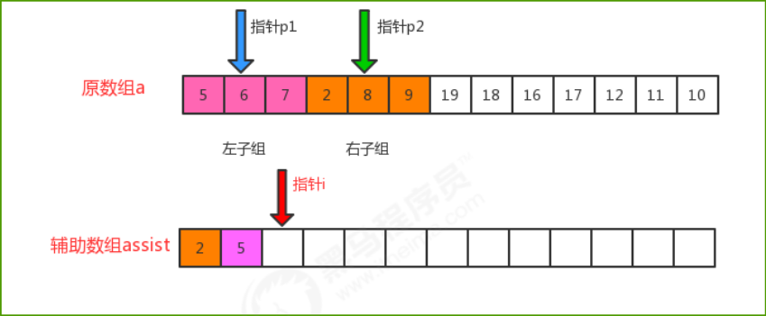

###### 依次类推...直到第四次填充完后

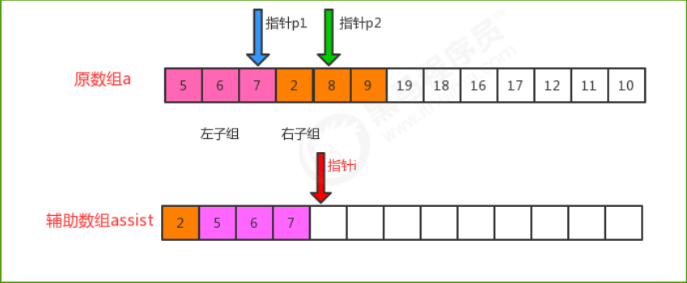

###### 第五次填充
此时左子组已经全部添加完成，p1指针已经指向末尾，不能再往后，我们只要将剩余的右子组按顺序填充即可，

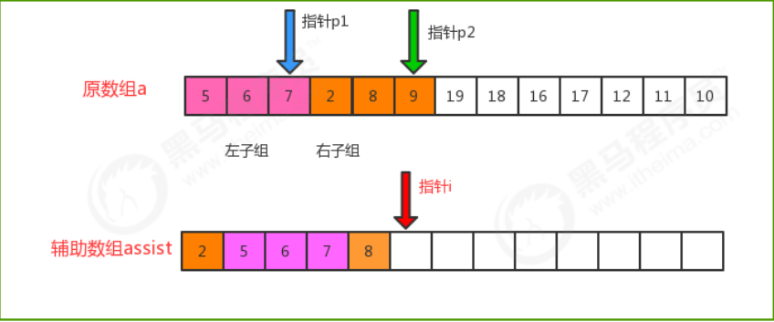

###### 第六次填充
最后一个填充完成后，指针不用再向下走

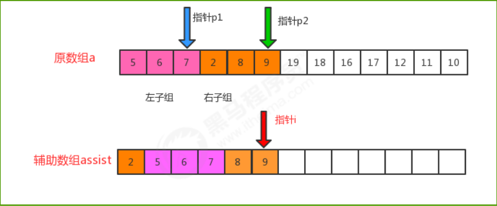

###### 最后把辅助数组中有序数据复制到原数组中
#### API设计，Merge.java
#### 时间复杂度分析
归并排序是分治思想的最典型的例子，上面的算法中，对a[lo...hi]进行排序，先将它分为a[lo...mid]和a[mid+1...hi]
两部分，分别通过递归调用将他们单独排序，最后将有序的子数组归并为最终的排序结果。该递归的出口在于如果
一个数组不能再被分为两个子数组，那么就会执行merge进行归并，在归并的时候判断元素的大小进行排序。


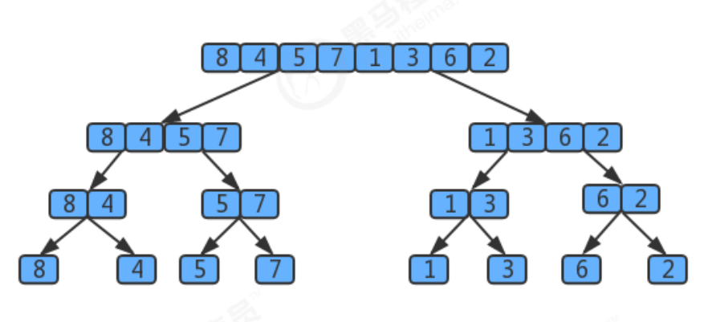


用树状图来描述归并，如果一个数组有8个元素，那么它将每次除以2找最小的子数组，共拆log8次，值为3，所以树共有3层,
那么自顶向下第k层有2^k个子数组，每个数组的长度为2^(3-k)，归并最多需要2^(3-k)次比较。
因此每层的比较次数为 2^k * 2^(3-k)=2^3,那么3层总共为 (3 * 2)^3。
假设元素的个数为n，那么使用归并排序拆分的次数为log2(n),所以共log2(n)层，那么使用log2(n)替换上面3*2^3中 的3这个层数，
最终得出的归并排序的时间复杂度为：log2(n)*2^(log2(n))=log2(n)*n,根据大O推导法则，忽略底数，最终归并排序的时间复杂度为O(NlogN);

### 快速排序
快速排序是对冒泡排序的一种改进。它的基本思想是：通过一趟排序将要排序的数据分割成独立的两部分，其中一
部分的所有数据都比另外一部分的所有数据都要小，然后再按此方法对这两部分数据分别进行快速排序，整个排序
过程可以递归进行，以此达到整个数据变成有序序列。
#### 排序原理：
1. 首先设定一个分界值，通过该分界值将数组分成左右两部分；
2. 将大于或等于分界值的数据放到到数组右边，小于分界值的数据放到数组的左边。此时左边部分中各元素都小于
或等于分界值，而右边部分中各元素都大于或等于分界值；
3. 然后，左边和右边的数据可以独立排序。对于左侧的数组数据，又可以取一个分界值，将该部分数据分成左右两
   部分，同样在左边放置较小值，右边放置较大值。右侧的数组数据也可以做类似处理。 
4. 重复上述过程，可以看出，这是一个递归定义。通过递归将左侧部分排好序后，再递归排好右侧部分的顺序。当
   左侧和右侧两个部分的数据排完序后，整个数组的排序也就完成了。
   
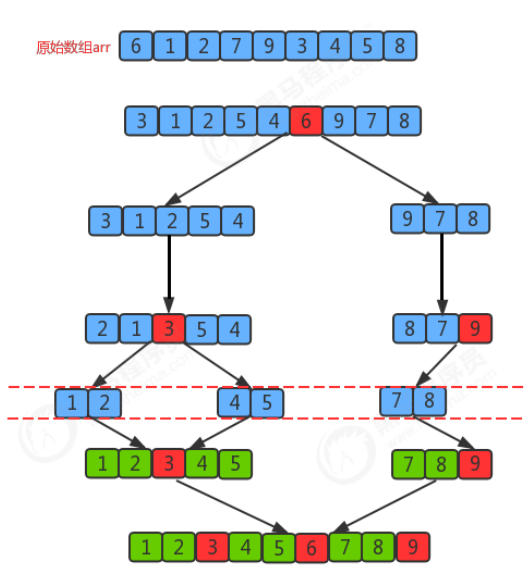

#### 把一个数组切分成两个子数组的基本思想：
1. 找一个基准值，用两个指针分别指向数组的头部和尾部
2. 先从尾部向头部开始搜索一个比基准值小的元素，搜索到即停止，并记录指针的位置；
3. 再从头部向尾部开始搜索一个比基准值大的元素，搜索到即停止，并记录指针的位置；
4. 交换当前左边指针位置和右边指针位置的元素；
5. 重复2,3,4步骤，直到左边指针的值大于右边指针的值停止。


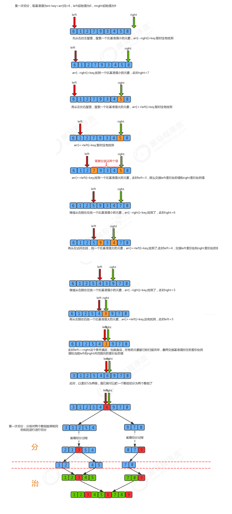
   


